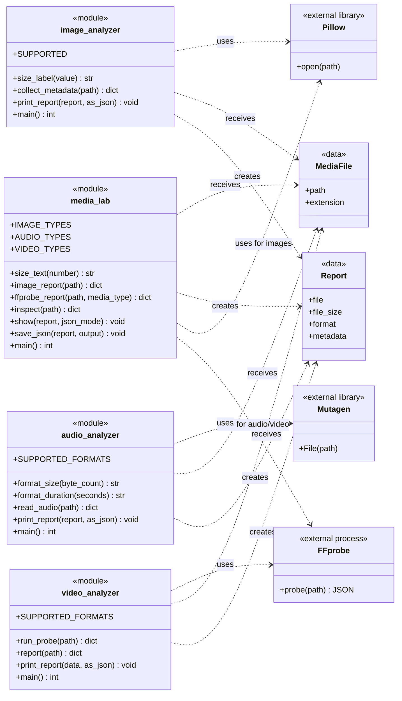
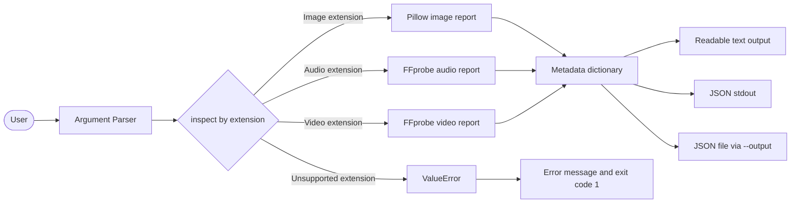
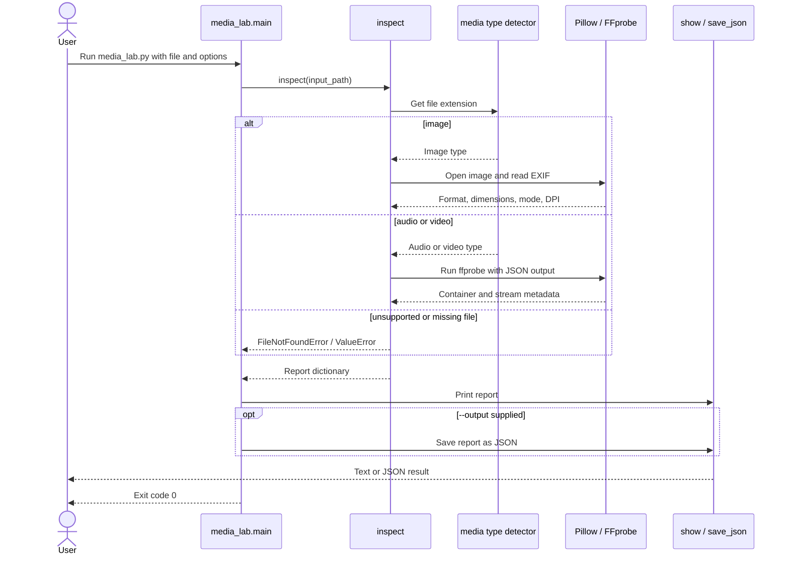

# Multimedia Systems Lab - UML Diagrams

## Class and module structure

```mermaid
classDiagram
    direction LR

    class media_lab {
        <<module>>
        +IMAGE_TYPES
        +AUDIO_TYPES
        +VIDEO_TYPES
        +size_text(number) str
        +image_report(path) dict
        +ffprobe_report(path, media_type) dict
        +inspect(path) dict
        +show(report, json_mode) void
        +save_json(report, output) void
        +main() int
    }

    class image_analyzer {
        <<module>>
        +SUPPORTED
        +size_label(value) str
        +collect_metadata(path) dict
        +print_report(report, as_json) void
        +main() int
    }

    class audio_analyzer {
        <<module>>
        +SUPPORTED_FORMATS
        +format_size(byte_count) str
        +format_duration(seconds) str
        +read_audio(path) dict
        +print_report(report, as_json) void
        +main() int
    }

    class video_analyzer {
        <<module>>
        +SUPPORTED_FORMATS
        +run_probe(path) dict
        +report(path) dict
        +print_report(data, as_json) void
        +main() int
    }

    class Pillow {
        <<external library>>
        +open(path)
    }

    class FFprobe {
        <<external process>>
        +probe(path) JSON
    }

    class Mutagen {
        <<external library>>
        +File(path)
    }

    class MediaFile {
        <<data>>
        +path
        +extension
    }

    class Report {
        <<data>>
        +file
        +file_size
        +format
        +metadata
    }

    media_lab ..> MediaFile : receives
    media_lab ..> Report : creates
    media_lab ..> Pillow : uses for images
    media_lab ..> FFprobe : uses for audio/video
    image_analyzer ..> Pillow : uses
    image_analyzer ..> MediaFile : receives
    image_analyzer ..> Report : creates
    audio_analyzer ..> Mutagen : uses
    audio_analyzer ..> MediaFile : receives
    audio_analyzer ..> Report : creates
    video_analyzer ..> FFprobe : uses
    video_analyzer ..> MediaFile : receives
    video_analyzer ..> Report : creates
```

## Unified analyzer component diagram

```mermaid
flowchart LR
    User([User]) --> CLI[Argument Parser]
    CLI --> Inspector{inspect by extension}

    Inspector -->|Image extension| Image[Pillow image report]
    Inspector -->|Audio extension| FFprobeAudio[FFprobe audio report]
    Inspector -->|Video extension| FFprobeVideo[FFprobe video report]
    Inspector -->|Unsupported extension| Error[ValueError]

    Image --> Report[Metadata dictionary]
    FFprobeAudio --> Report
    FFprobeVideo --> Report

    Report --> Text[Readable text output]
    Report --> JSON[JSON stdout]
    Report --> File[JSON file via --output]
    Error --> Terminal[Error message and exit code 1]
```

## Unified inspection sequence

```mermaid
sequenceDiagram
    actor User
    participant CLI as media_lab.main
    participant Inspector as inspect
    participant Detector as media type detector
    participant Library as Pillow / FFprobe
    participant Output as show / save_json

    User->>CLI: Run media_lab.py with file and options
    CLI->>Inspector: inspect(input_path)
    Inspector->>Detector: Get file extension
    alt image
        Detector-->>Inspector: Image type
        Inspector->>Library: Open image and read EXIF
        Library-->>Inspector: Format, dimensions, mode, DPI
    else audio or video
        Detector-->>Inspector: Audio or video type
        Inspector->>Library: Run ffprobe with JSON output
        Library-->>Inspector: Container and stream metadata
    else unsupported or missing file
        Inspector-->>CLI: FileNotFoundError / ValueError
    end
    Inspector-->>CLI: Report dictionary
    CLI->>Output: Print report
    opt --output supplied
        CLI->>Output: Save report as JSON
    end
    Output-->>User: Text or JSON result
    CLI-->>User: Exit code 0
```
